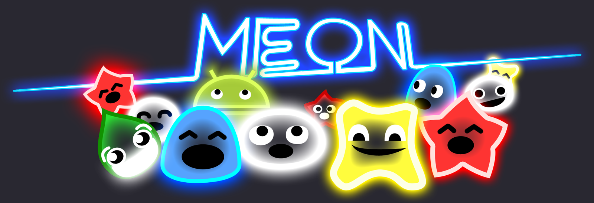

# Meon for iOS

This repo contains the source code of Meon, a game by Manbolo on iOS / Android.

This is an archived version of the iOS version, for conservation purpose. The project was targeting iOS 7 SDK, and is 
not intended to compile on the lastest iOS SDK.

It is written in Objective-C / UIKit.

## License

Meon iOS is released under Apache 2.0 license.

## Screenshots

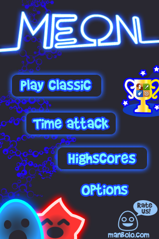

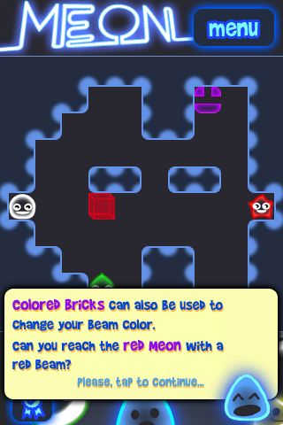

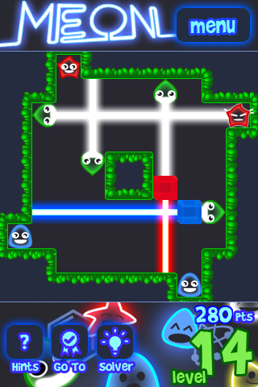

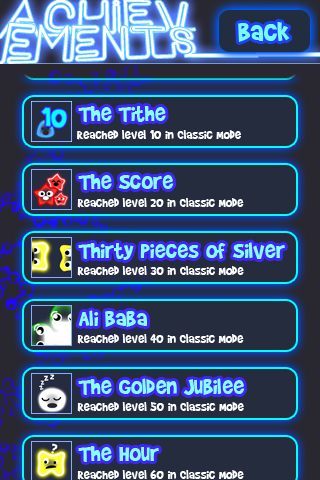

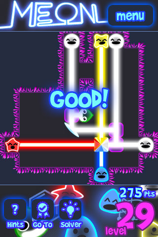

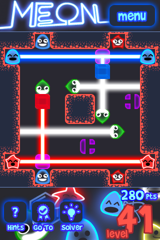

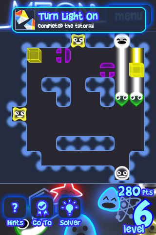

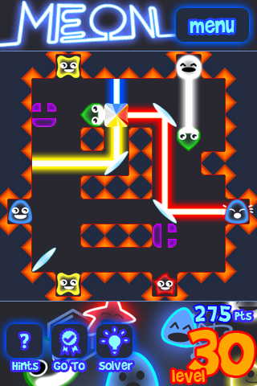

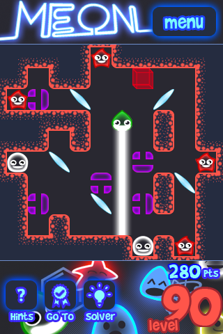

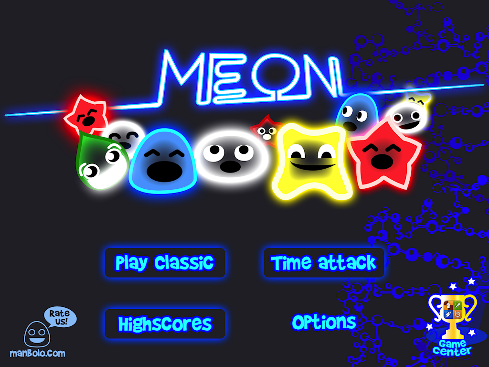

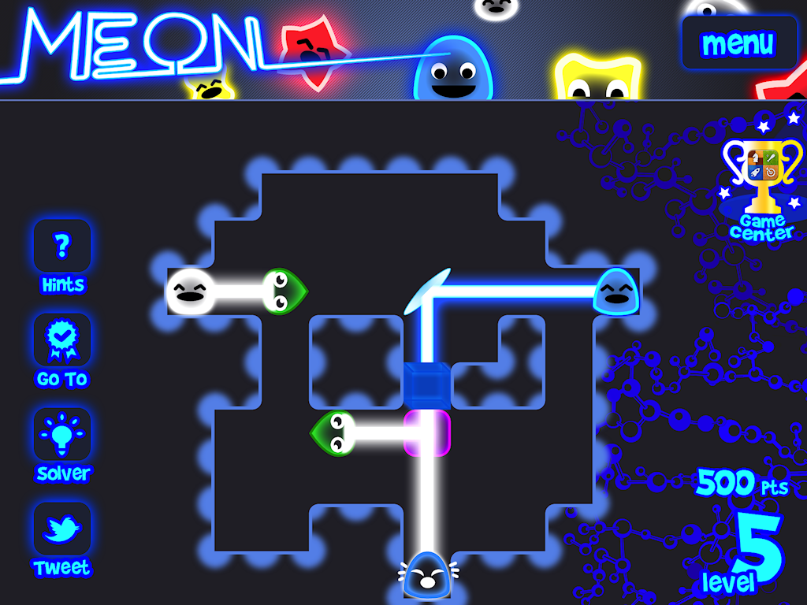

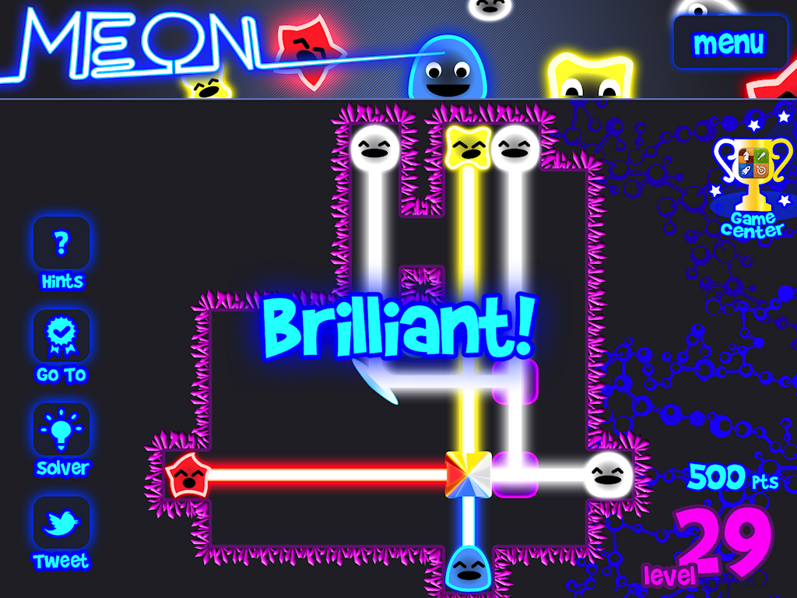

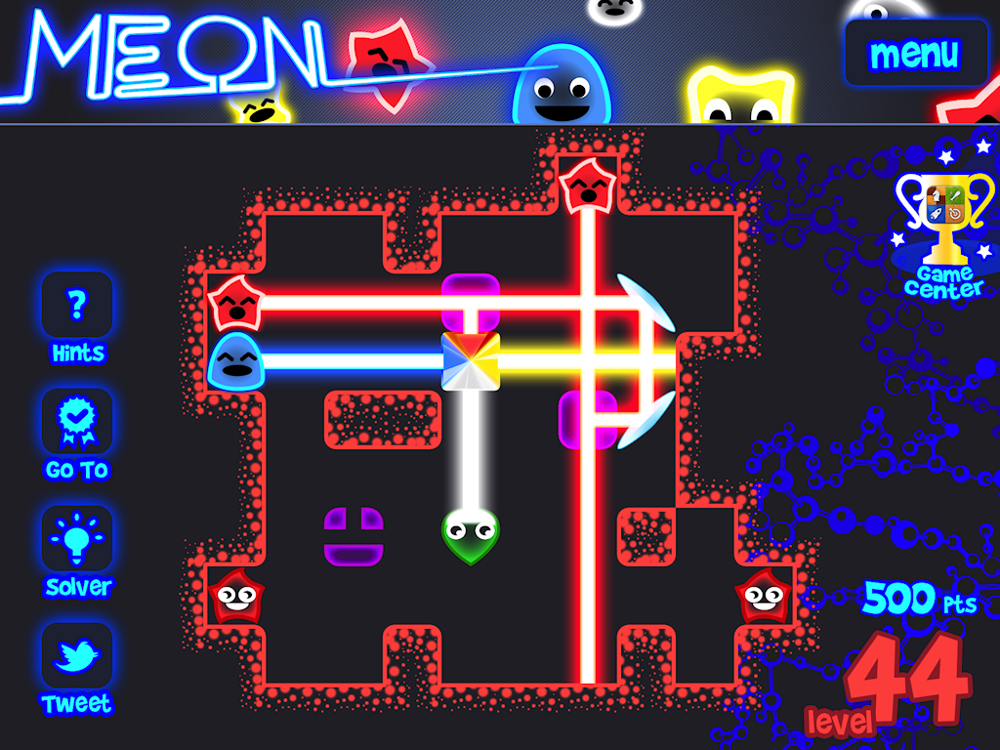

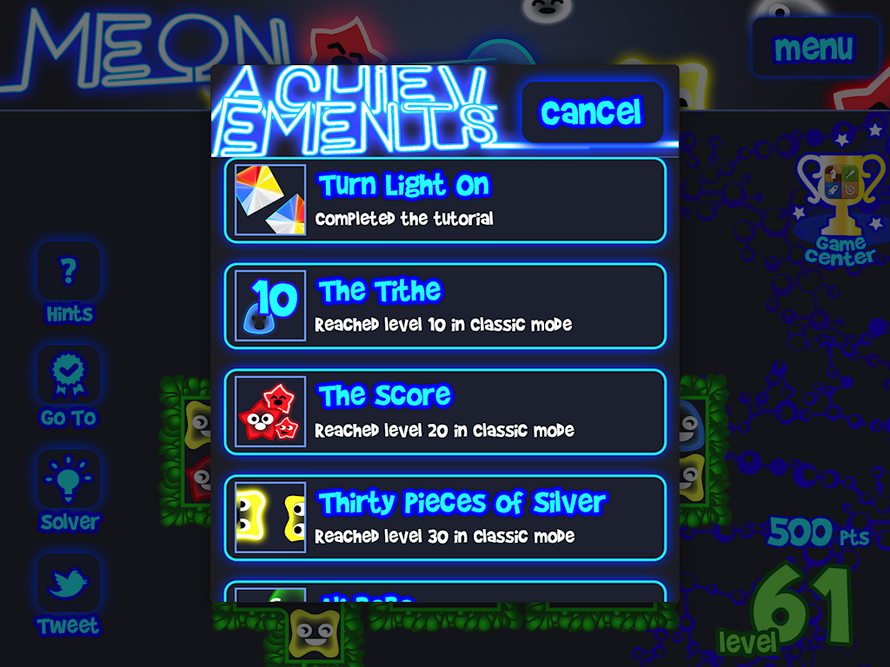

## Walkthrough

[All Meon's 120 levels Walkthrough](docs/walkthrough.md)